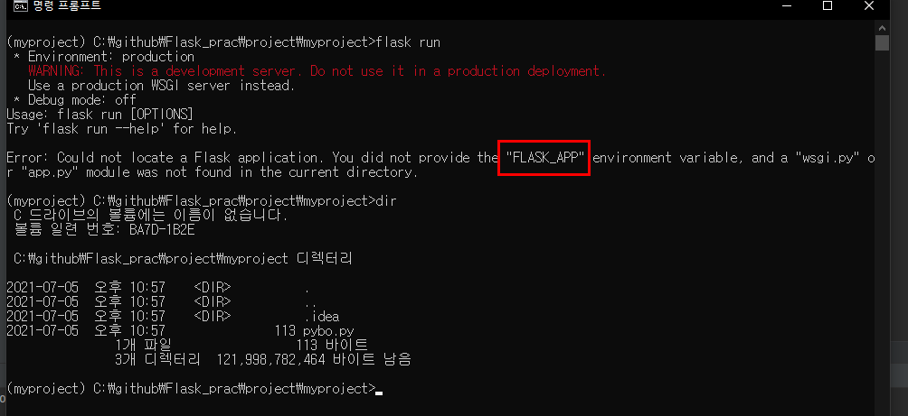

# 01-6 안녕하세요, 파이보!

<br>

### 첫 번째 애플리케이션 만들기

<br>

01 단계 새 파이썬 파일 만들기

pybo.py

```powershell
from flask import Flask

app = Flask(__name__)

@app.route('/')
def hello_pybo():
    return "Hello, Pybo!"
```

```powershell
app = Flask(__name__)

# __name__ == pybo
```

는 애플리케이션을 생성하는 코드다. 이 코드에서 **name은 모듈명이 담긴다.**

```powershell
@app.route('/')
```

특정 주소에 접속하면 바로 다음 줄에 있는 함수를 호출하는 플라스크의 데코레이터이다.

<br>

02 단계 플라스크 서버 실행하기

```powershell
(myproject) C:\github\Flask_prac\project\myproject>flask run
```



실행하면 '플라스크 애플리케이션을 찾을 수 없다'는 오류 메시지가 발생한다.

오류 메시지를 조금 더 자세히 보면 "FLASK_APP" 환경 변수 설정을 해야한다"라고 표시되어 있다.

> flask를 실행시키려면 FLASK_APP이라는 환경 변수에 플라스크 애플리케이션을 지정해 주어야 한다.

지정해주지 않으면 기본적으로
app.py
값이 들어간다.

<br>

03 기본 애플리케이션 설정하기

```powershell
set FLASK_APP=pybo
flask run
```


잘 수행 된다. 그런데 여전히 뭔가 미심쩍은 경고 메시지가 보인다.

이는 운영환경으로 실행되었기 때문이다.

서버에 아무런 설정을 하지 않으면 기본 운영 환경으로 실행한다.

<br>

04 단계 플라스크 서버를 개발 환경으로 실행하기

```powershell
set FLASK_ENV=development
```


개발환경으로 변경하고 실행하면 아무런 경고 메시지 없이 플라스크 서버가 실행되는것을 알 수 있다.

 그후 127.0.0.1:5000 로 접속 해보면 실행되었음을 알 수 있다.


<br>

05 단계 실습을 더 간편하게 환경 변수 추가하기

지금까지 설정한 대로라면 앞으로 플라스크 서버를 실행하려면 다음 명령어를 매번 입력해야한다.

즉, 매번 FLASK_APP과 FLASK_ENV 변수를 설정한 다음 플라스크를 실행시켜야 한다.

```powershell
set FLASK_APP=pybo
set FLASK_ENV=development
flask run
```

그래서 myproject.cmd 파일에 이 명령어를 미리 추가해 놓기로 한다.