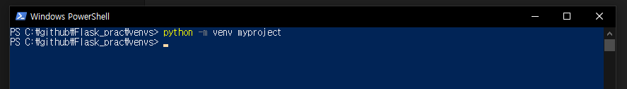

# 01-3 플라스크 개발환경 준비하기

개발을 시작하기 전에 가상환경을 만들것이다.

<br>

### 파이썬 가상환경 알아보기

파이썬 가상환경은 파이썬 프로젝트를 진행할 때 독립된 환경을 만들어주는 도구이다.

<br>

### 파이썬 가상환경 사용해 보기

01 단계 가상 환경 디렉터리 생성하기

```powershell
PS C:\github\Flask_prac\ mkdir venvs
PS C:\github\Flask_prac\ cd venvs
PS C:\github\Flask_prac\venvs>
```

02단계 가상환경 만들기

```powershell
PS C:\github\Flask_prac\venvs> python -m venv myproject
```



python -m venv는 파이썬 모듈 중 venv라는 모듈을 사용한다는 의미다.

myproject는 가상환경의 이름이다.

03단계 가상환경에 진입하기

```powershell
PS C:\github\Flask_prac\venvs> cd myproject\Scripts
C:\github\Flask_prac\venvs\myproject\Scripts> activate

(myproject) C:\github\Flask_prac\venvs\myproject\Scripts>
```

가상환경이 있는 Script 디렉터리의 activate라는 명령을 수행해야 한다.


04단계 가상환경에서 벗어나기

```powershell
(myproject) C:\github\Flask_prac\venvs\myproject\Scripts> deactivate
C:\github\Flask_prac\venvs\myproject\Scripts>
```


<br>

### 플라스크 설치하기

01 단계 가상환경인지 확인하기

```powershell
C:\github\Flask_prac\venvs\myproject\Scripts> activate

(myproject) C:\github\Flask_prac\venvs\myproject\Scripts>
```

02 단계 가상환경에서 플라스크 설치하기

```powershell
(myproject) C:\github\Flask_prac\venvs\myproject\Scripts> pip install Flask
```


03 단계 pip 최신 버전으로 설치하기

```powershell
(myproject) C:\github\Flask_prac\venvs\myproject\Scripts> python -m pip install --upgrade pip
```

