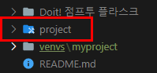

# 01-4 플라스크 프로젝트 생성하기

플라스크에서 프로젝트는 하나의 웹사이트라고 생각하면 된다.

플라스크 프로젝트 안에는 보통 한 개의 플라스크 애플리케이션이 존재한다.

<br>

### 프로젝트 디렉터리 생성하기

01단계 프로젝트 루트 디렉터리 생성하기

```powershell
mkdir projects
cd projects
```



02 단계 프로젝트 루트 디렉터리 안에서 가상 환경에 진입하기

```powershell
C:\github\Flask_prac\project>C:\github\Flask_prac\venvs\myproject\Scripts\activate
(myproject) C:\github\Flask_prac\project>
```

03 단계 플라스크 프로젝트를 담을 디렉터리 생성하고 이동하기

```powershell
(myproject) C:\github\Flask_prac\project>mkdir myproject

(myproject) C:\github\Flask_prac\project>cd myproject

(myproject) C:\github\Flask_prac\project\myproject>
```


<br>

### 배치 파이로 myproject 가상 환경에 간단히 진입하기

01단계 배치파일 생성하기

venvs 디렉터리에 myproject.cmd 파일을 만들고 다음처럼 작성한 후 저장하자.

```powershell
@echo off
@cd C:\github\Flask_prac\project\myproject
@C:\github\Flask_prac\venvs\myproject\Scripts\activate
```

02단계 배치 파일 위치를 PATH 환경 변수에 추가하기


03단계 PATH 환경 변수 확인하기


04단계 배치 파일 실행하여 가상 환경에 진입하기

