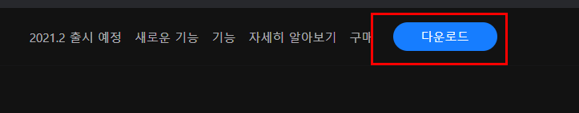

# 01-5 파이참 설치하고 사용해보기

 

### 파이참 설치하기

01 단계 파이참 설치 파일 내려받고 설치하기

[PyCharm을 다운로드해 주셔서 감사합니다](https://www.jetbrains.com/ko-kr/pycharm/download/download-thanks.html?platform=windows&code=PCC)

02단계 파이참 실행하기

윈도우 시작 버튼을 누르고 프로그램 목록에서 [ JetBrains > PyCharm Community Edition ]을 선택하면 파이참이 실행된다.

 

### 파이참 인터프리터 설정하기

01단계 현재 파이썬 인터프리터 위치 확인하기

File > Settings

