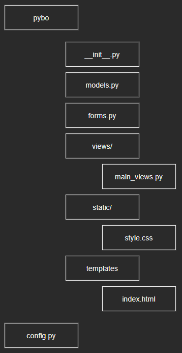

# 02-1 플라스크 기초 다지기

플라스크는 프로젝트 구조를 어떻게 만들어야 한다는 기준이 없다.

그래서 처음 구성할 때 생각을 많이 해야 한다.

 

### 플라스크 프로젝트 구조 살펴보기

앞으로 만들 구조이다.

1작성한 [pybo.py](http://pybo.py) 파일은 pybo 패키지로 변경할 수 있다.

이 구조 에서 보듯 pybo 디렉터리 안에 있는 init.py파일이 그 역할을 대신할 것이다.

 

### 데이터베이스를 처리하는 [models.py](http://models.py) 파일

파이보 프로젝트는 ORM ( object relational mapping )을 지원하는 파이썬 데이터베이스 도구인

SQLAlchemy를 사용한다.

SQLAlchemy는 모델 기반으로 데이터베이스를 처리한다.

 

### 서버로 전송된 폼을 처리하는 [forms.py](http://forms.py) 파일

파이보 프로젝트는 웹 브라우저에서 서버로 전송된 폼을 처리할 때 WTForms라는 라이브러리를 사용한다.

WTForms 역시 모델 기반으로 폼을 처리한다.

 

### 화면을 구성하는 views 디렉터리

views 디렉터리에는 바로 이런 함수들이 작성된 여러가지 뷰 파일을 저장 한다.

파이보 프로젝트에는 기능에 따라

main_views.py

question_views.py

answer_views.py등 여러가지 뷰 파일을 만들 것이다.

 

### CSS, 자바스크립트, 이미지 파일을 저장하는 static 디렉터리

static 디렉터리는 파이보 프로젝트의 스타일시트, 자바스크립트, 이미지 파일등을 저장하는 폴더이다.

 

### HTML 파일을 저장하는 templates 디렉터리

여기에는 HTML 파일이 저장할것이다.

 

### 파이보 프로젝트를 설정하는 [config.py](http://config.py) 파일

[config.py](http://config.py) 파일은 파이보 프로젝트를 설정한다. 파이보 프로젝트의 환경 변수, 데이터 베이스 등의 설정을 이 파일에 저장한다.