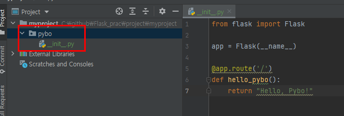

# 02-2 플라스크 애플리케이션 팩토리

1장에서 플라스크 앱을 간단히 알아보았다. 실제로 플라스크 앱은 다음 코드에서 보듯 Flask 클래스로 만든 객체를 말한다.

```python
app = Flask(__name__)
```

플라스크는 app객체를 사용해 여러 가지 설정을 진행한다.

그런데 이와 같은 방식으로 app 객체를 전역으로 사용하면 프로젝트 규모가 커질수록 문제가 발생할 확률이 높아진다. 순환참조 오류가 대표적이다.

<br>

### 애플리케이션 팩토리 사용하기

app 객체를 전역으로 사용할 때 발생하는 문제를 예방하는 방법은

"애플리케이션 팩토리"를 사용하는 방법이다.

1단계 pybo.py를 [init.py](http://init.py) 파일로 변경하기



그후 서버를 실행시키면


정상적으로 작동한다.

2단계 애플리케이션 팩토리 사용하기

[init.py](http://init.py) 파일을 열고 create_app 함수를 선언하는 방식으로 코드를 수정하자.

```python
from flask import Flask

def create_app():
    app = Flask(__name__)
    @app.route('/')
    def hello_pybo():
        return "Hello, Pybo!"
    return app
```


정상적으로 작동한다.