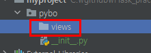

# 02-3 블루프린트로 라우트 함수 관리하기

pybo/__init__.py 파일내용에

create_app 함수 안에 hello_pybo 함수가 들어 있다. 

hello_pybo함수는 URL에서 /에 매핑되는 함수인데,

그 매핑을 @app.route('/')라는 애너테이션이 만들어 준다.

이때 @app.route와 같은 애너테이션으로 매핑되는 함수를 라우트 함수라고 한다.

하지만 여기에는 불편함이 있다. 이때

블루프린트 클래스를 사용한다.

<br>

### 블루 프린트 사용하기

플라스크의 블루프린트를 이용하면 라우트 함수를 구조적으로 관리할 수 있다.

1단계 블루프린트 생성하기



views디렉토리 생성 후 

main_views.py 파일 생성

pybo/views/main_views.py

```python
from flask import Blueprint

# 블루 프린트 객체
bp = Blueprint("main", __name__, url_prefix='/')

@bp.route('/')
def hello_pybo():
    return "hello, Pybo!"
```

2단계 플라스크 앱 생성 시 블루프린트 적용하기

pybo/__init__.py

```python
from flask import Flask

def create_app():
    app = Flask(__name__)

    from .views import main_views
    app.register_blueprint(main_views.bp) # 블루프린트 객체 bp 등록

    return app
```

create_app 함수에 등록되었던 hello_pybo 함수 대신 블루 프린트를 사용하도록 변경했다.

3단계 라우트 함수 등록하기

pybo/views/main_views.py

```python
from flask import Blueprint

# 블루 프린트 객체
bp = Blueprint("main", __name__, url_prefix='/')

@bp.route('/hello')
def hello_pybo():
    return "hello, Pybo!"

@bp.route('/')
def index():
    return "Pybo index"
```

4단계 동작 확인하기

