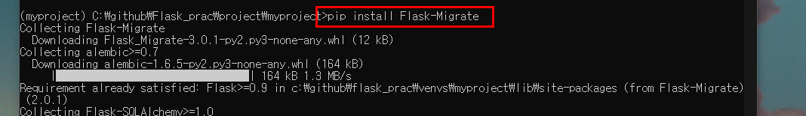

# 02-4 모델로 데이터 처리하기

게시판의 질문이나 답변을 작성하면 데이터가 생성된다.

원래 데이터베이스는 SQL 쿼리 라는 구조화된 질의를 작성하고 실행하는 등 복잡한 과정이 필요하다.

이때 ORM을 이용하면 파이썬 문법만으로도 데이터베이스를 다룰 수 있다.

ORM을 이용하면 개발자가 쿼리를 직접 작성하지 않아도 데이터베이스의 데이터를 처리할 수 있다.

<br>

### 데이터베이스를 쉽게 사용할 수 있게 해주는 ORM 알아보기

관계형 데이터 베이스와의 소통은 SQL문을 이용해서 해야한다.

```sql
insert into question (subject, sontent) values ('안녕하세요', '가입인사드립니다.!');
insert into question (subject, sontent) values ('질문이 있습니다.', 'ORM이 궁금합니다.');
```

하지만 ORM을 사용하면 쿼리 대신 파이썬 코드로 다음처럼 작성할 수 있다.

```python
question1 = Question(subject="안녕하세요", content="가입인사 드립니다.")
db.session.add(question1)

question2 = Question(subject="질문이 있습니다.", content="ORM이 궁금합니다.")
db.session.add(question2)
```

코드에서 Question은 파이썬 클래스이며, 이처럼 데이터를 관리하는 데 사용하는 ORM 클래스를 모델이라고 한다

모델을 사용하면 내부에서 SQL을 자동으로 생성해 부므로 직접 작성하지 않아도 된다.

<br>

### 플라스크 ORM 라이브러리 사용하기

1단계 ORM 라이브러리 설치하기

Flask-Migrate 라이브러리를 설치하면 SQLAlchemy도 함께 설치되므로 myproject 가상 환경에서 다음 명령을 수행하여 Flask-Migrate 라이브러리를 설치하자.

```powershell
pip install Flask-Migrate
```



2단계 설정 파일 추가하기

파이보 ORM을 적용하려면 [config.py](http://config.py) 라는 설정 파일이 필요하다. 루트 디렉터리에 config.py 파일을 생성하고 다음과 같은 코드를 작성한다.

C: /projects/myproject/config.py

```python
import os

# 프로젝트의 루트 디렉터리
BASE_DIR = os.path.dirname(__file__)

# 데이터 베이스 접속 주소
SQLALCHEMY_DATABASE_URI = 'sqlite:///{}'.format(os.path.join(BASE_DIR, 'pybo.db'))

# 이벤트를 처리하는 옵션
SQLALCHEMY_TRACK_MODIFICATIONS = False
```

3단계 ORM 적용하기

이어서 pybo/__init__.py 파일을 수정해서 SQLAlchemy를 적용하자.

C: /projects/myproject/pybo/__init__.py

```python
from flask import Flask
from flask_migrate import Migrate
from flask_sqlalchemy import SQLAlchemy

import config

db = SQLAlchemy()
migrate = Migrate()

def create_app():
    app = Flask(__name__)
    app.config.from_object(config)

    # ORM
    db.init_app(app)
    migrate.init_app(app, db)

    # 블루프린트 객체 bp 등록
    from .views import main_views
    app.register_blueprint(main_views.bp)

    return app
```

[config.py](http://config.py) 파일에 작성한 항목을 app.config 환경변수로 부르기 위해 app.config.from_object(config) 코드를 추가했다.

그리고 전역 변수로 db, migrate 객체를 만든 다음 create_app 함수 안에서 init_app 메서드를 이용해 초기화 했다.

플라스크에서는 이러한 패턴을 자주 사용한다. db 객체를 create_app 함수 안에서 생성하면 블루 프린트와 같은 모듈에서 불러올 수 없다. 따라서 db, migrate와 같은 객체를 create_app 함수 밖에서 생성하고, 실제 객체 초기화는 create_app 함수에서 수행한다.

4 단계 데이터베이스 초기화 하기

이제 ORM을 사용할 준비가 되었으므로 flask db init 명령으로 데이터베이스를 초기화 하자

```python
flask db init
```


이 명령은 데이터베이스를 관리하는 초기 파일들을 migrations라는 디렉터리에 자동으로 생성해 준다. 이때 생성되는 파일들은 Flask-Migrate 라이브러리에서 사용된다. 우리는 이 파일의 내용을 알 필요가 없다.


<br>

### 데이터베이스 관리 명령어 정리하기

앞으로 모델을 추가하거나 변경할 때는 

flask db migrate 명령이나

flask db upgrade 명령만 사용할 것이다.

즉, 앞으로 데이터베이스 관리를 위해 여러분이 기억해야 할 명령어는이 2가지 뿐이다.

```python
flask db migrate # 모델을 새로 생성하거나 변경할 때 사용
flask db upgrade # 모델의 변경 내용을 실제 데이터베이스에 적용할 때 사용.
```

<br>

### 모델 만들기

1단계 모델 속성 구상하기

질문 속성


답변 속성


2단계 질문 모델 생성하기

이렇게 구상한 속성을 바탕으로 모델을 정의해보자. 먼저 pybo 디렉터리에 [models.py](http://models.py) 파일을 생성하고 질문 모델인 Question 클래스를 정의해보자.

C: /projects/myproject/pybo/models.py

```python
from pybo import db

class Question(db.Model):
    id = db.Column(db.Integer, primary_key=True)
    subject = db.Column(db.String(200), nullable=False)
    content = db.Column(db.Text(), nullable=False)
    create_date = db.Column(db.DataTime(), nullable=False)
```

```python
id = db.Column(db.Integer, primary_key=True)
```

위의 코드를 해석하면

- db.Integer : 속성의 데이터 타입 지정
- primary_key=True : 속성을 기본키로 지정
- nullable=False  : 빈값을 허용하지 않는다는 조건

3단계 답변 모델 생성하기

이어서 같은 파일에 답변 모델인 Answer 클래스도 작성하자.

```python
class Answer(db.Model):
    id = db.Column(db.Integer, primary_key=True)
    qestion_id = db.Column(db.Integer,
                           db.ForeignKey("question.id", ondelete="CASCADE"))
    qestion = db.relationship("Question", backref=db.backref("answer_set"))
    content = db.Column(db.Text(), nullable=False)
    create_date = db.Column(db.DataTime(), nullable=False)
```

qestion_id과 qestion왜 두개가 필요하고 어떤 의미인지 살펴보면

qestion_id는 질문 모델과 연결하기 위해서 추가했다. 

답변 모델은 어떤 질문에 대한 답변인지 표시해야 하므로 2단계에서 생성한 질문 모델과 연결된 속성을 포함해야 한다.

이처럼 어떤 속성을 기존 모델과 연결하려면 db.ForeignKey를 사용해야 한다.

```python
question_id = db.Column(db.Integer,
                        db.ForeignKey("question.id", ondelete="CASCADE"))
```

db.ForeignKey("question.id", ondelete="CASCADE")에 지정한 첫 번째 값은

연결할 모델의 속성이고( "question.id" ) 삭제 연동 설정 ( ondelete="CASCADE" )

그 다음 question속성은 답변 모델에서 질문 모델을 참조하려고 추가했다.

```python
question = db.relationship("Question", backref=db.backref("answer_set"))
```

<br>

### 모델을 이용해 테이블 자동으로 생성하기

1단계 모델 가져오기

C: /projects/myproject/pybo/__init__.py

```python
# ORM
    db.init_app(app)
    migrate.init_app(app, db)
    from . import models
```

2단계 데이터베이스 변경을 위한 리비전 파일 생성하기

모델을 추가 했으므로 데이터베이스가 변경되도록 명령 프롬프트에서

```python
flask db migrate
```

명령을 수행하자.


이 과정에서 데이터베이스에 모델 이름과 똑같은 question과 answer라는 이름의 테이블이 생성된다. 지금까지 설명한 1~3단계를 제대로 수행했다면 projects/myproject 디렉터리에 pybo.db 파일이 생성되었을 것이다.


3단계 데이터베이스 갱신하기

이어서 flask db upgrade 명령으로 리비전 파일을 실행하자.


<br>

### 생성된 테이블 살펴보기

db를 살펴보기 위해서는

SQLite의 GUI 도구인 DB Browser for SQLite를 사용한다.

1단계 DB Browser for SQLite 설치하기

[sqlitebrower.org/dl에](http://sqlitebrower.org/dl에) 접속한다음 DB Broswer for SQLite(이하 DB 브라우저) 설치 파일 ( standard installer )을 내려받아 설치를 진행하자. 설치 시 체크 옵션에 주의하자.


2단계 DB 브라우저에서 pybo.db 열기


<br>

### 모델 사용하기

flask shell을 사용해서 모델 사용법을 알아보자.

1단계 플라스크 셀 실행하기

```python
flask shell
```


2단계 질문 데이터 저장하기

다음 명령을 수행해 Qeustion과 Answer 모델을 불러오자

```python
from pybo.models import Question, Answer
from datetime import datetime
q = Question(subject='pybo가 무엇인가요?', content='pybo에 대해서 알고 싶습니다.',
						 create_date=datetime.now())
```


q 객체를 DB 에 저장해야 한다.

```python
from pybo import db
db.session.add(q)
db.session.commit()
```


- db.session.add(q) : 저장소로 옮기기
- db.session.rollback() : 저장소 저장 취소
- db.session.commit() : 적용하기

q 객체의 id 확인

```python
q.id
```


id는 자동으로 1씩 증가한다.

```python
q = Question(subject='2pybo가 무엇인가요?', content='2pybo에 대해서 알고 싶습니다.',
						 create_date=datetime.now())
db.session.add(q)
db.session.commit()
```


저장후 1이 더 증가한것을 알 수 있다.

3단계 데이터 조회하기

이번에는 데이터베이스에 저장된 데이터를 모두 조회해 보자.

```python
Question.query.all()
```


filter 함수를 이용해 원하는 데이터만 추출이 가능하다.

```python
Question.query.filter(Question.id==1).all()
```


get 함수를 이용해서 원하는 id 만 조회가 가능하다.

다만 get 함수로 조회하면 리스트가 아닌 Question 객체 1개만 반환된다.

```python
Question.query.get(1)
```


이번에는 filter와 like 함수로 subject 속성에 플라스크 라는 문자열이 포함된 데이터를 조회해 보자.

```python
Question.query.filter(Question.subject.like("%2%")).all()
```


4단계 데이터 수정하기

```python
q = Question.query.get(2)
q.subject = "Flask Model Question"
db.session.commit()
```


5단계 데이터 삭제하기

```python
q = Question.query.get(1)
db.session.delete(q)
db.session.commit()
```


6 답변 데이터 생성 후 저장하기

```python
from datetime import datetime
from pybo.models import Question, Anwer
from pybo import db
q = Question.query.get(2)
a = Answer(question=q, content="네 자동으로 생성됩니다.", create_date=datetime.now())
db.session.add(a)
db.session.commit(a)
```

확인

```python
a.id
a = Answer.query.get(1)
```


7단계 답변에 연결된 질문 찾기 vs 질문에 달린 답변 찾기

앞에서 구성한 Answer 모델의 question 속성을 이용하면 '답변에 연결될 질문'을 조회할 수 있다.

```python
a.question
```


```python
q.answer_set
```

