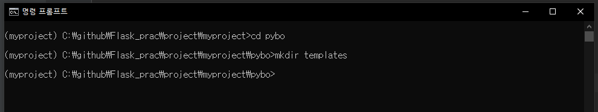

# 02-5 질문 목록 조회와 질문 상세 조회 기능 만들기

이번 절에서는 파이보의 핵심 기능인 질문 목록 조회와 질문 상세 조회를 구현할 것이다.

<br>

### 질문 목록 조회 기능 만들기

<br>

### 게시판 질문 목록 출력하기

C: /projects/myproject/pybo/views/main_views.py

```python
from flask import Blueprint, render_template

from pybo.models import Question

# 블루 프린트 객체
bp = Blueprint("main", __name__, url_prefix='/')

@bp.route('/hello')
def hello_pybo():
    return "hello, Pybo!"

@bp.route('/')
def index():
    # 질문 목록 조회
    # order_by 정렬
    # Question.create_date.desc() 작성 날짜 최근순
    question_list = Question.query.order_by(Question.create_date.desc())
    return render_template("question/question_list.html",
                           question_list = question_list)
```

템플릿과 모델을 가져온다

### 질문 목록 템플릿 파일 작성하기

render_template 함수에서 사용할 /question/question_list.html 템플릿 파일을 작성해야 한다.

이 파일은 templates 라는 디렉터리에 자장한다.

```powershell
(myproject) C:\github\Flask_prac\project\myproject>cd pybo

(myproject) C:\github\Flask_prac\project\myproject\pybo>mkdir templates
```



생성한 템플릿 파일

/question/question_list.html

```python

    <ul>
        
        <li><a href="/detail/{{ question.id }}/">{{ question.subject }}</a></li>
        
    </ul>

    <p>질문이 없습니다.</p>

```

위에 보이는 는 탬플릿 태그라고 불린다. 이 탬플릿 코드가 python과 html을 연결해주는 코드이다.

```python

```

위의 if  문에서 데이터가 있는지 검사후

```python

```

위의 for문에서 데이터를 뿌려준다.

그후 데이터를 출력한다.

```python
{{ question.id }}
```

그럼 결과가 나온것을 볼 수 있다.


이전에 등록한 질문 1건이 조회된 모습이다. 만약 플라스크 셸에서 Question 모델 데이터를 추가했다면 더 많은 질문이 표시될 것이다.

<br>

### 플라스크에서 자주 사용하는 템플릿 태그

1. 분기문 태그

```python

	<p>조건문1에 해당하면 실행<p>

	<p>조건문2에 해당하면 실행<p>

	<p>조건문1, 2 모두 해당하지 않으면 실행<p>


```

2. 반복문 태그

```python

	<p>순서 : {{ loop.index }} <p>
	<p>{{ item }}<p>        

```

3. 객체 태그

객체를 출력하는 템플릿 태그도 있다.

```python
{{ 객체 }}
```

객체의 속성은 점(.)으로 이어서 출력할 수 있다.

```python
{{ 객체.속성 }}
```

<br>

### 게시판 상세 조회 기능 만들기

앞서 만든 링클르 누르면 Not Found 에러가 발생한다.

이 이유는

localhost:5000/detail/2/ 페이지가 없기 때문이다.

<br>

### 라우트 함수 구현하기

```python
localhost:5000/detail/2/
```

아래와 같이 라우트 함수를 작성한다.

C: /projects/myproject/pybo/views/main_views.py

```python
...

@bp.route("/detail/<int:question_id>/")
def detail(question_id):
    question = Question.query.get(question_id)
    return render_template("question/question_detail.html",
                           question = question)
```

<br>

### 질문 상세 템플릿 파일 작성하기

이어서 질문 상세 조회 화면에 해당하는 템플릿 페이지 작성

question/question_detail.html

```python
<h1>{{ question.subject }}</h1>

<div>
    {{ question.content }}
</div>
```

<br>

### 404 오류 페이지 표시하기

웹 브라우저에서 [localhost:5000/detail/30/](http://localhost:5000/detail/30/) 페이지를 요청해 보자.

페이지를 요청했을 때 빈화면이 나온다.


이처럼 잘못된 URL을 요청받을  때 단순히 빈 페이지를 표시하면 안된다. 이때는 보통 'Not Found (404)' 처럼 오류페이지를 표시해야 한다.

주요 응답 코드

- 200 : 성공
- 500 : 서버 오류 ( Internal Server Error )
- 404 : 서버가 요청한 페이지 없음 ( Not Found )

기존의 함수를 수정헤서 404 애러를 출력해 보자.

C: /projects/myproject/pybo/views/main_views.py

```python
@bp.route("/detail/<int:question_id>/")
def detail(question_id):
    question = Question.query.get_or_404(question_id)
    return render_template("question/question_detail.html",
                           question = question)
```


<br>

### 블루프린트로 기능 분리하기

모든 기능을 main_views.py 파일에 구현했다. 모든 기능을 main_views.py 파일에 구현할 수도 있지만 

각 기능을 02-3절에서 배운 블루프린트 파일로 분리해서 관리하면 유지 보수 하는데 유리하다.

<br>

### 질문 목록 조회, 질문 상세 조회 기능 분리하기

pybo/views 디렉터리에 question_views.py 만들어 분리 해보자.

C: /projects/myproject/pybo/views/question_views.py

```python
from flask import Blueprint, render_template

from pybo.models import Question

bp = Blueprint("question", __name__, url_prefix="/question")

@bp.route("/list/")
def _list():
    question_list = Question.query.order_by(Question.create_date.desc())
    return render_template("question/question_list.html",
                           question_list=question_list)

@bp.route("/detail/<int:question_id>/")
def detail(question_id):
    question = Question.query.get_or_404(question_id)
    return render_template("question/question_detail.html", question=question)
```

C: /projects/myproject/pybo/__init__.py

```python
from flask import Flask
from flask_migrate import Migrate
from flask_sqlalchemy import SQLAlchemy

import config

db = SQLAlchemy()
migrate = Migrate()

def create_app():
    app = Flask(__name__)
    app.config.from_object(config)

    # ORM
    db.init_app(app)
    migrate.init_app(app, db)
    from . import models

    # 블루프린트 객체 bp 등록
    from .views import main_views, question_views
    app.register_blueprint(main_views.bp)
    app.register_blueprint(question_views.bp)

    return app
```

<br>

### url_for로 리다이렉트 기능 추가하기

question_views.py 파일에 질문 목록과 질문 상세 조회 긴으을 구현했으므로 main_views.py 파일에서는 해당 기능을 제거하자.

C: /projects/myproject/pybo/views/main_views.py

```python
from flask import Blueprint, url_for
from werkzeug.utils import redirect

# 블루 프린트 객체
bp = Blueprint("main", __name__, url_prefix='/')

@bp.route('/hello')
def hello_pybo():
    return "hello, Pybo!"

@bp.route('/')
def index():
    return redirect(url_for("question._list"))
```

<br>

### 하드 코딩된 URL에 url_for 함수 이용하기

C: /projects/myproject/pybo/templates/question/question_list.html

```python

    <ul>
        
        <li><a href="{{ url_for('question.detail', question_id=question.id }}">{{ question.subject }}</a></li>
        
    </ul>

    <p>질문이 없습니다.</p>

```


<br>

### url_for 함수를 사용하면 유지.보수하기 쉬워진다.

템플릿에서 URL을 사용할 때 다음과 같이 url_for를 사용하지 않으면 어떻게 될까?

- url이 변경되면 적혀있는 코드부분을 전부 고쳐줘야 한다.
- 따라서 url_for 을 사용하는것이 효율적이다.