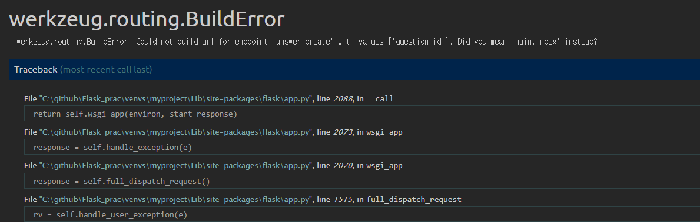

# 02-6 답변 등록 기능 만들기

<br>

### 답변 데이터 저장하고 표시하기

질문 상세 조회 화면에 답변을 입력하기 위한 텍스트 창(texttarea)과 <답변등록> 버튼을 생성하고, 이 버튼을 누르면 텍스트 창에 입력된 데이터가 저장되도록 구현

1단계 답변 등록 버튼 만들기

/question/question_list.html

```python
<h1>{{ question.subject }}</h1>

<div>
    {{ question.content }}
</div>

<form action="{{ url_for('answer.create', question_id=question.id) }}" method="post">
    <textarea name="content" id="content" rows="15"></textarea>
    <input type="submit" value="답변등록">
</form>
```

답변 저장 URL은 form 엘리먼트 action 속성에 지정된 url_for('answer.create', question_id=[question.id](http://question.id/)) 함수가 알려준다.

그후 버튼을 누르면 POST 방식으로 form 엘리먼트의 action 속성에 등록된 URL이 호출된다.



이 오류를 해결하려면 답변 모델에 해당하는 블루프린트 파일을 작성하고 create 함수를 만들어야 한다.

2단계 답변 블루프린트 만들기

question을 관리하는 블루프린트를 만들었듯이 답변 모델 answer를 관리하는 블루프린트를 만들어 보자.

views 디렉터리에 answer_views.py 파일을 만들고 다음처럼 코드를 작성하자.

/views/answer_views.py

```python
from datetime import datetime

from flask import Blueprint, url_for, request
from werkzeug.utils import redirect

from pybo import db
from pybo.models import Question, Answer

bp = Blueprint("answer", __name__, url_prefix="/answer")

@bp.route("/create/<int:question_id>", methods=("POST",))
def create(question_id):
    question = Question.query.get_or_404(question_id)
    content = request.form["content"]
    answer = Answer(content=content, create_date=datetime.now())
    question.answer_set.append(answer)
    db.session.commit()
    return redirect(url_for("question.detail", question_id=question_id))
```

3단계 답변 블루 프린트 적용하기

2단계에서 생성한 블루프린트 객체 answer_views.bp를 pybo/__init__.py

파일에 드록하자.

pybo/__init__.py

```python
from flask import Flask
from flask_migrate import Migrate
from flask_sqlalchemy import SQLAlchemy

import config

db = SQLAlchemy()
migrate = Migrate()

def create_app():
    app = Flask(__name__)
    app.config.from_object(config)

    # ORM
    db.init_app(app)
    migrate.init_app(app, db)
    from . import models

    # 블루프린트 객체 bp 등록
    from .views import main_views, question_views, answer_views
    app.register_blueprint(main_views.bp)
    app.register_blueprint(question_views.bp)
    app.register_blueprint(answer_views.bp)

    return app
```


4단계 질문 상세 페이지에 답변 표시하기

질문에 등록된 답변을 화면에 표시해보자. 답변은 질문과 함께 보여야 하므로 질문 상세 조회 템플릿 파일에 다음 코드를 추가한다.

/question/question_list.html

```python
<h1>{{ question.subject }}</h1>

<div>
    {{ question.content }}
</div>

<h5>{{ question.answer_set|length }}개의 답변이 있습니다.</h5>
<div>
    <ul>
        
            <li>{{ answer.content }}</li>
        
    </ul>
</div>

<form action="{{ url_for('answer.create', question_id=question.id) }}" method="post">
    <textarea name="content" id="content" rows="15"></textarea>
    <input type="submit" value="답변등록">
</form>
```

